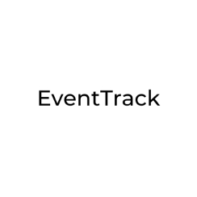
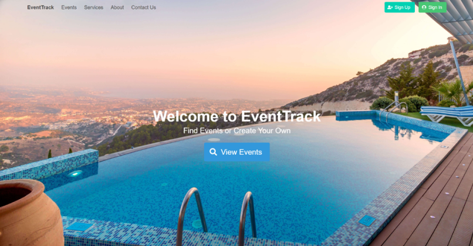
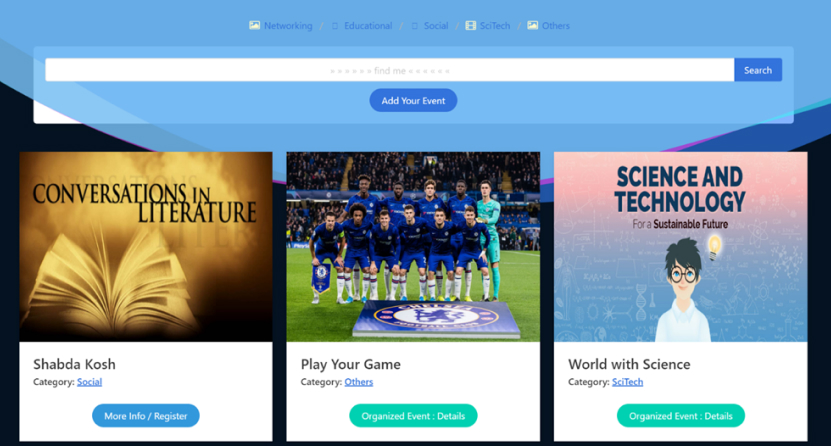
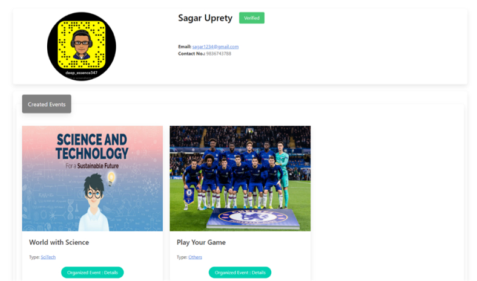
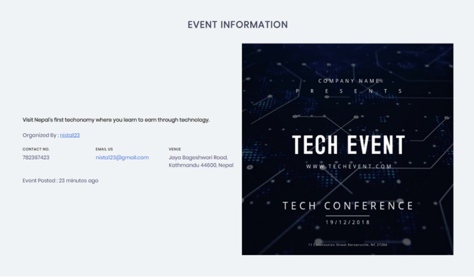
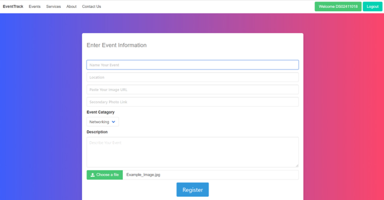

<h1 align="center">
    
</h1>
<h3 align="center">
    <b>EventTrack - An event management platform</b>
</h3>


## About 
<h1></h1>

EventTrack is a common web platfrom for Event management. The application can be used by both organisers and users for promoting and finding an event. 

## Key Features 🧑‍💻

- Searching the events based on categories, location and time of the event 
- Exploring the information of the event and registering for an event
- Creating and promoting events using single platform
- Monitoring and managing the participants of the event

## Run Locally (Development Environment) ⚒️

#### Clone the repository and navigate to the project root directory.
Make sure you have [npm and Node.js](https://docs.npmjs.com/downloading-and-installing-node-js-and-npm) installed on your machine. Also setup [MongoDB server](https://www.mongodb.com/docs/manual/tutorial/install-mongodb-on-windows/).


```bash
# Get packages
npm install
```

``` bash
# Run node app
node app.js
```

```bash
# Accessing the app via browser
http://localhost:3000
``` 


## Tech and Tools Used 💻

- Frontend : HTML5, CSS3, JavaScript, Bootstrap, EJS
- Database : MongoDB
- Backend  : Node.js, Express

  
## Screenshots 

<div align="center">
  
  
  
  
  
</div>

## Contributions

Contributions are highly appreciated. Please send a Pull Request with suggested changes or open an Issue to get things started!
